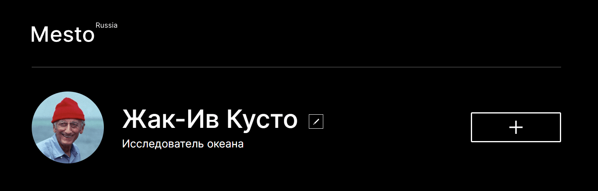
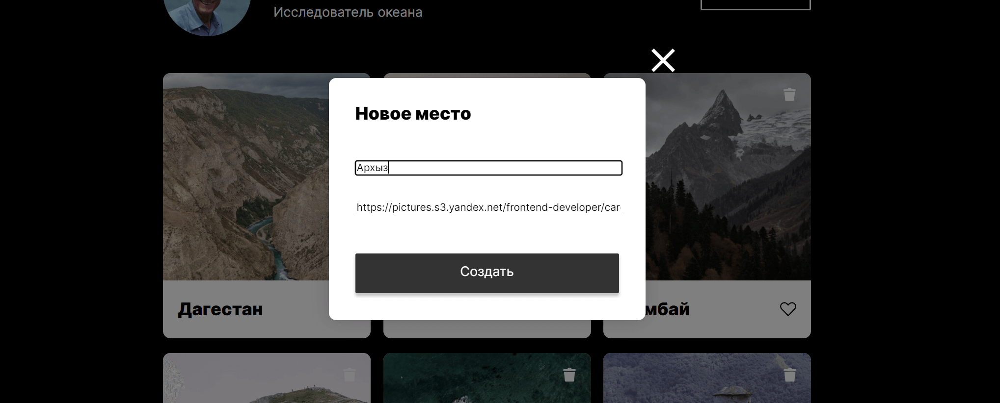
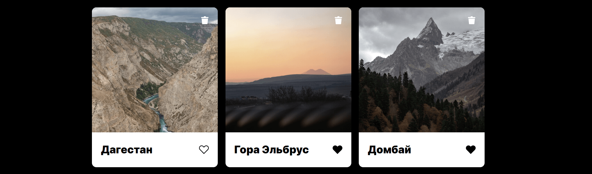
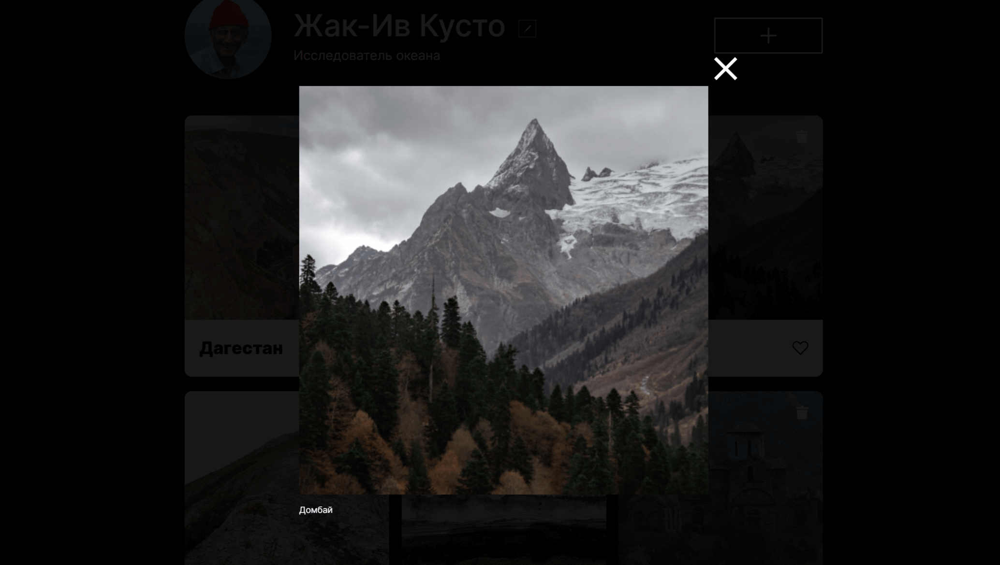

# __Проект: Место__

*Проектная работа на курсе по веб-разработке от [Яндекс-практикума](https://practicum.yandex.ru/ "Перейти на сайт практикума")*

## Обзор

Проект интерактивного сервиса о путешествиях по России, выполненный на основе [макета](https://www.figma.com/file/2cn9N9jSkmxD84oJik7xL7/JavaScript.-Sprint-4?node-id=0%3A1 "Посмотреть макет") в Figma. 

Для реализации проекта были использованы технологии Grid Layout, flexbox, а также применены медиазапросы. С помощью Java Script организованa функция редактирования профиля:

На страницу можно добавлять свои карточки мест:

Карточки также можно удалять или отмечать сердечком, кликнув по соответствующим иконкам:

Изображение из карточки можно увеличить, кликнув по нему:

Реализовано плавное открытие и закрытие попапов. Любой попап можно закрыть кликнув за пределами модального окна, или нажав Esc.
На сайте работает живая валидация форм.

## Последние обновления

* Произведен рефакторинг кода согласно принципам ООП.

**[Ссылка на сайт](https://sashakostiukova.github.io/mesto/)**

## __Связаться со мной__
sashakostiukova@yandex.ru